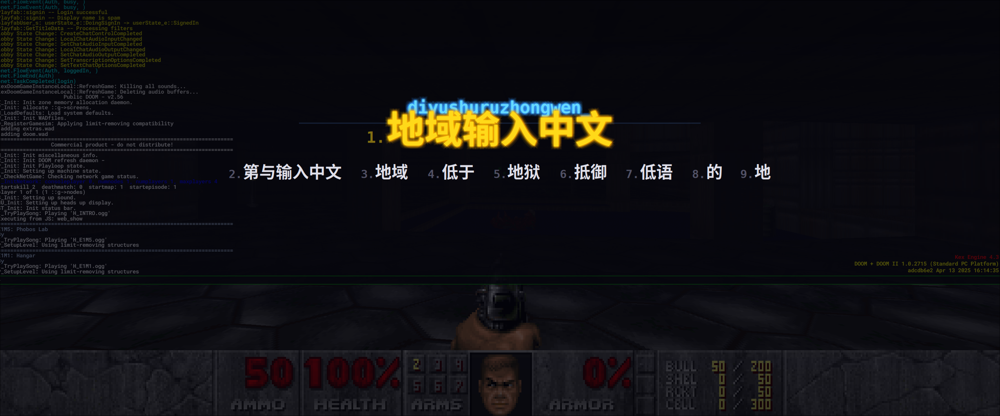

# wlime

A fullscreen arcade-style CJK input method for Hyprland.

wlime replaces traditional IME popup menus with a translucent fullscreen overlay — think arcade high-score initial entry, not a dropdown next to your cursor. It works in regular apps, XWayland browsers, and even fullscreen games.

## Features

- **Fullscreen overlay** with CRT scanlines, neon glow text, and rainbow particle effects
- **Pinyin input** powered by libpinyin with candidate selection (1-9, Space, Enter)
- **Works everywhere** — native Wayland apps via input-method-v2, XWayland apps, and clipboard+paste fallback
- **Sound effects** — arcade blips on keystrokes, commits, and toggles.
- **Sparkle mode** — rainbow cycling, impact bursts on keystrokes, celebration explosions on commit
- **Configurable** — Sound and sparkles optional. Multiple backends, incl RIME.

## Dependencies

- A wayland compositor (tested on hyprland and sway)
- GTK 3, gtk-layer-shell
- libpinyin
- wayland-client, xkbcommon, cairo
- wlr-protocols
- PipeWire (for sound effects via pw-play)
- ffmpeg (optional, generates sound effects on first run)

## Building

```bash
meson setup build
ninja -C build
```
```
yay -S wlime-git
```

## Usage

```bash
# Start wlime
./build/wlime

# Toggle composition mode (bind this in hyprland.conf)
wlime toggle
wlime languages
wlime switch <one of the languages>
```

Hyprland keybind example:
```
bind = SUPER, space, exec, wlime toggle
```

When composition mode is active:
- Type pinyin (e.g. `nihao`)
- **1-9** select a candidate
- **Space** or **Enter** commits the first candidate
- **Escape** cancels
- **Backspace** edits the pinyin buffer

## Configuration

Copy `config.example` to `~/.config/wlime/config`:

```
language = rime:luna_pinyin_simp
clipboard_always = true
sounds = true
animate = true
fade_duration_ms = 150
sparkle = true
```

## Screenshots



## Architecture

wlime is a standalone Wayland client (not a Hyprland plugin) using standard protocols:

- `zwp_input_method_v2` — keyboard grab and text commit
- `zwp_virtual_keyboard_v1` — key forwarding
- `zwlr_layer_shell_v1` — fullscreen overlay surface
- Separate `wl_display` connection integrated into GTK's event loop via GSource

## License

GPL-3.0 (inherits from libpinyin)
